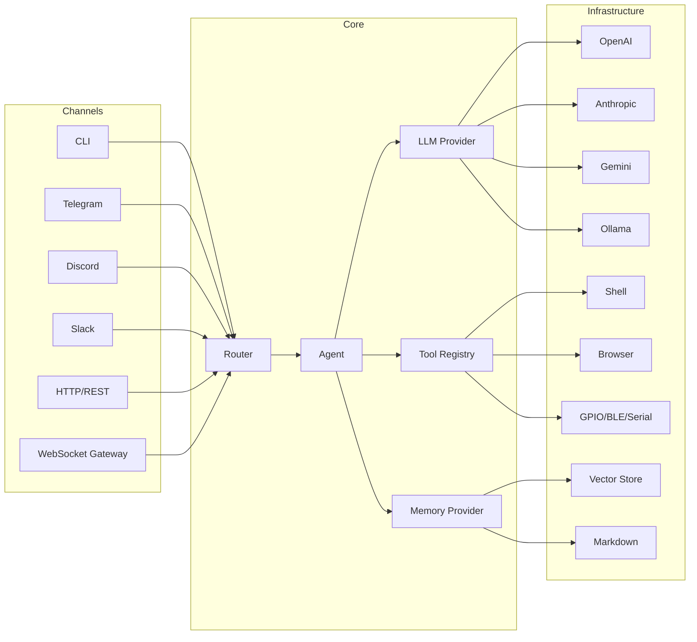

# alfred-ai

> Production-grade, privacy-first AI agent framework in Go

[](https://golang.org/dl/)
[](LICENSE)
[](https://github.com/hieuntg81/alfred-ai/actions/workflows/ci.yml)
[](https://goreportcard.com/report/github.com/hieuntg81/alfred-ai)

alfred-ai is a self-hosted AI agent framework that connects any LLM to your tools, channels, and devices. It ships as a single binary with long-term memory, built-in security, and a plugin system — no external services required beyond an LLM API key.

## Features

| Category | What's included |
|---|---|
| **Channels** | CLI, HTTP/REST, Telegram, Discord, Slack, WhatsApp, Matrix, Teams, Google Chat, Signal, IRC, WebChat |
| **LLM Providers** | OpenAI, Anthropic, Gemini, OpenRouter, Ollama, AWS Bedrock — with automatic failover and circuit breaker |
| **Skills** | 35 built-in skills: code review, summarize, translate, web research, draft email, debug, security review, and [more](docs/reference/skills.md) |
| **Tools** | 27+ tools: shell, filesystem, browser, web search, GitHub, email, calendar, MQTT, voice calls, camera, MCP bridge, and [more](docs/reference/tools.md) |
| **Edge / IoT** | GPIO, BLE, serial port, camera, location — via build tags for minimal binary size |
| **Security** | Filesystem sandbox, SSRF protection, AES-256-GCM encryption, tamper-evident audit logs, RBAC, GDPR compliance, secret scanning |
| **Multi-Agent** | Agent registry, message broker, configurable routing strategies (default, prefix, config-based) |
| **Plugins** | Go native + WASM sandbox, permission model with allow/deny lists |
| **Memory** | Markdown, vector (with embedding cache + MMR diversity), time-decay search, auto-curation |
| **Observability** | Structured logging (slog), OpenTelemetry tracing, SOC2/GDPR audit events |

## Quick Start

### Option 1: Docker (fastest)

```bash
git clone https://github.com/hieuntg81/alfred-ai && cd alfred-ai
cp .env.example .env   # add your API key
docker compose up -d
```

### Option 2: Setup Wizard (recommended)

```bash
go install github.com/hieuntg81/alfred-ai/cmd/agent@latest
alfred-ai setup
```

The wizard walks you through provider selection, channel configuration, and security settings interactively.

### Option 3: From Source (contributors)

```bash
git clone https://github.com/hieuntg81/alfred-ai && cd alfred-ai
make build
./alfred-ai setup
```

Verify your setup:

```bash
alfred-ai doctor
```

## What You Can Build

**Personal AI assistant** — CLI + long-term memory + 35 skills for coding, writing, research, and daily planning.

**Team Slack/Discord bot** — Multi-channel deployment with per-user sessions, RBAC, and tool approval gating.

**IoT automation hub** — GPIO, BLE, and serial control via MQTT with scheduled tasks and voice call notifications.

**Secure enterprise agent** — AES-256-GCM encrypted memory, tamper-evident audit logs, GDPR consent tracking, and secret scanning.

**Multi-agent system** — Specialized agents with independent prompts, models, and tool sets, routed by channel, group, or prefix.

## Architecture

alfred-ai follows clean architecture with zero external dependencies in the domain layer:



```
cmd/agent/          Composition root — wires everything together
internal/domain/    Pure types and interfaces (zero external deps)
internal/usecase/   Business logic (agent loop, router, sessions)
internal/adapter/   Implementations (LLM, channels, tools, gateway)
internal/security/  Security primitives (sandbox, encryption, SSRF, audit)
internal/plugin/    Plugin system (discovery, WASM, permissions)
internal/infra/     Cross-cutting (config, logger, tracer)
pkg/pluginsdk/      Public SDK for building plugins
pkg/nodesdk/        Public SDK for building edge nodes
```

## Documentation

### For Users

- [Getting Started](docs/getting-started.md) — Installation, setup wizard, first conversation
- [Configuration Reference](docs/reference/config.md) — All YAML options and environment variables
- [Skills Index](docs/reference/skills.md) — All 35 built-in skills
- [Tools Index](docs/reference/tools.md) — All 27+ built-in tools
- [Channel Guides](docs/guides/) — Setup guides for each platform

### For Operators

- [Deployment Guide](docs/deployment.md) — Docker, Docker Compose, Kubernetes, Fly.io
- [Security](docs/security.md) — Encryption, SSRF, sandboxing, audit logging, secret scanning
- [Troubleshooting](docs/troubleshooting.md) — Common issues and solutions

### For Contributors

- [Contributing](CONTRIBUTING.md) — Development setup, code style, PR process
- [Architecture & Patterns](docs/architecture.md) — Design decisions and code patterns
- [Testing Guide](docs/development/testing.md) — Unit, integration, fuzz, and benchmark testing
- [CI/CD](docs/development/ci-cd.md) — GitHub Actions workflows

## Why alfred-ai?

- **Go** — Single binary, <100MB RAM, no runtime dependencies. Cross-compiles to Linux, macOS, Windows on amd64 and arm64.
- **Privacy-first** — Fully self-hosted. Encrypted memory. No telemetry, no cloud dependency beyond your chosen LLM provider.
- **Security built-in** — Filesystem sandbox, SSRF protection with DNS rebinding prevention, tamper-evident audit logs, RBAC, and secret scanning are core features, not afterthoughts.
- **Edge-native** — GPIO, BLE, and serial support via build tags. Runs on Raspberry Pi with the same binary.
- **Production-grade** — Multi-tenant support, clustering, offline mode, context window guard, automatic failover with circuit breaker, and graceful shutdown.

## Contributing

We welcome contributions! See [CONTRIBUTING.md](CONTRIBUTING.md) for the full guide.

**Areas where we'd love help:**

- New channel integrations (Teams, Google Chat, Signal, IRC)
- Additional LLM provider adapters
- New skills in `skills/`
- Documentation improvements
- Performance optimizations — check our [benchmarks](docs/development/testing.md#benchmarks)

Look for issues labeled [`good first issue`](https://github.com/hieuntg81/alfred-ai/labels/good%20first%20issue) to get started.

## License

[MIT License](LICENSE)

Built with a focus on security, privacy, and developer experience.
