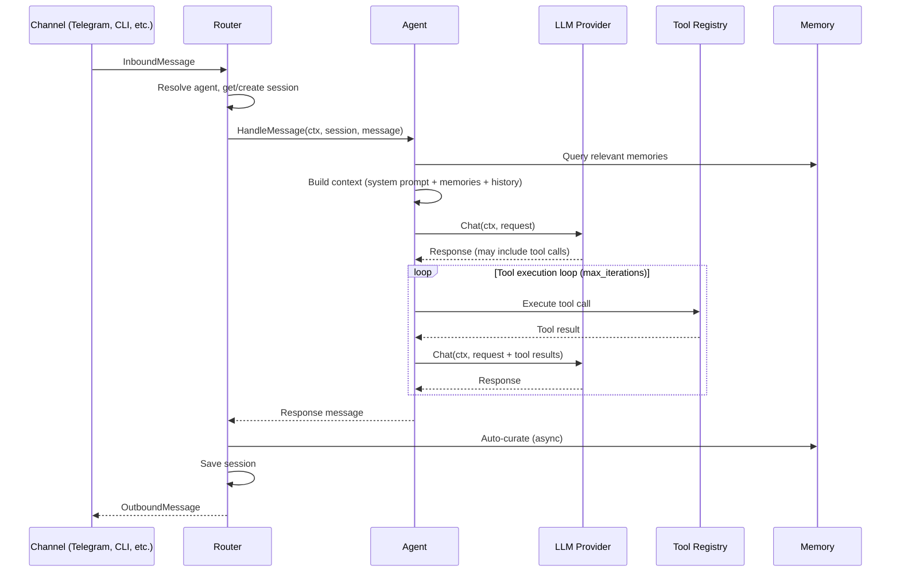

# Architecture

alfred-ai follows clean architecture principles with strict layer boundaries, zero external dependencies in the domain layer, and dependency injection throughout.

## Layer Overview

```
cmd/agent/          Composition root — wires everything together
internal/domain/    Pure types and interfaces (zero external deps)
internal/usecase/   Business logic orchestration
internal/adapter/   External system integrations
internal/security/  Security primitives
internal/plugin/    Plugin system lifecycle
internal/infra/     Cross-cutting infrastructure
pkg/pluginsdk/      Public SDK for plugins
pkg/nodesdk/        Public SDK for edge nodes
```

**Key rule:** Dependencies point inward. `adapter` imports `domain`, never the reverse. The `domain` package has zero external dependencies.

## Data Flow



## Key Packages

| Package | Purpose |
|---------|---------|
| `internal/domain` | Interfaces (`LLMProvider`, `Channel`, `Tool`, `MemoryProvider`), entities, sentinel errors |
| `internal/usecase` | Agent loop, Router pipeline, Session management, Compressor, Context Builder |
| `internal/adapter/llm` | OpenAI, Anthropic, Gemini, OpenRouter, Ollama, Bedrock adapters + failover + circuit breaker |
| `internal/adapter/channel` | CLI, HTTP, Telegram, Discord, Slack, WhatsApp, Matrix, Teams, Google Chat, Signal, IRC, WebChat |
| `internal/adapter/tool` | 27+ tool implementations + registry |
| `internal/adapter/gateway` | WebSocket/SSE gateway + REST API |
| `internal/adapter/memory` | Markdown, vector (with embedding cache), tenant-scoped, cached |
| `internal/adapter/skill` | Skill loader and tool adapter |
| `internal/security` | Sandbox, SSRF protection, encryption, audit logging, secret scanning, key rotation, GDPR |
| `internal/plugin` | Plugin discovery, WASM runtime, permissions, registry |
| `internal/infra/config` | YAML config loader with env var overrides, validation, secret decryption |
| `cmd/agent` | Composition root — phased initialization wiring all layers together |

## Design Patterns

### Domain-Centric Interfaces

All core interfaces live in `internal/domain/` with zero external dependencies:

```go
type LLMProvider interface {
    Chat(ctx context.Context, req ChatRequest) (*ChatResponse, error)
    Name() string
}

type Channel interface {
    Start(ctx context.Context, handler MessageHandler) error
    Stop(ctx context.Context) error
    Send(ctx context.Context, msg OutboundMessage) error
    Name() string
}
```

Interfaces are small (3-5 methods), single-purpose, and consumer-defined. Extended capabilities use interface embedding with runtime type assertions:

```go
type StreamingLLMProvider interface {
    LLMProvider
    ChatStream(ctx context.Context, req ChatRequest) (<-chan StreamDelta, error)
}
```

### Phased Initialization

`cmd/agent/` splits initialization into focused files by concern. Each `init_*.go` file returns a typed components struct:

```go
// cmd/agent/main.go — run() chains them in dependency order:
// 1. Config → 2. Logger & Tracer → 3. Security → 4. LLM →
// 5. Event Bus → 6. Memory → 7. Agent → 8. Features →
// 9. Runtime → 10. Graceful shutdown
```

### Dependency Injection via Structs

The project uses named dependency structs rather than long constructor parameter lists:

```go
type AgentDeps struct {
    LLM            domain.LLMProvider
    Memory         domain.MemoryProvider
    Tools          ToolExecutor
    ContextBuilder *ContextBuilder
    Logger         *slog.Logger
    MaxIterations  int
    AuditLogger    domain.AuditLogger   // optional, nil = no audit
    Compressor     *Compressor          // optional, nil = no compression
}
```

Optional dependencies are nil-checked at usage sites.

### Registry Pattern

Thread-safe registries manage named resources using `sync.RWMutex`:

- `tool.Registry` — tools available for LLM function calling
- `llm.Registry` — LLM provider instances
- `multiagent.Registry` — agent instances in multi-agent mode
- `tool.ChannelRegistry` — channels available for the message tool

### Router as Message Pipeline

The Router implements a 10-step pipeline for every inbound message:

1. Resolve agent (single or multi-agent mode)
2. Normalize session key
3. Get or create session
4. Invoke `OnMessageReceived` hooks
5. Publish `EventMessageReceived`
6. Call `agent.HandleMessage`
7. Build outbound response + onboarding hints
8. Invoke `OnResponseReady` hooks
9. Publish `EventMessageSent`
10. Save session + fire-and-forget auto-curate

### Error Handling

Domain errors use sentinels for programmatic matching and structured errors for rich context:

```go
// Sentinel — for errors.Is() matching
var ErrToolNotFound = fmt.Errorf("tool not found")

// Structured — for contextual error messages
type DomainError struct {
    Op     string // "Tool.Execute"
    Err    error  // underlying sentinel
    Detail string // human-readable detail
}
```

Non-fatal errors (memory queries, hooks) are logged but don't block the primary flow.

### Configuration

Configuration follows a precedence chain: **defaults < YAML file < environment variables**. Validation is accumulative — all errors are collected before reporting. API keys can be stored encrypted with an `enc:` prefix and decrypted at load time.

## Security Architecture

Security is layered, not bolted on:

- **Filesystem sandbox** — All tool file operations go through `Sandbox.ValidatePath()` which resolves symlinks before checking containment
- **SSRF protection** — Custom HTTP transport resolves DNS once, validates all IPs, then connects directly (prevents TOCTOU/DNS rebinding attacks)
- **Content encryption** — AES-256-GCM with Argon2id key derivation, applied at the serialization boundary
- **Audit logging** — Append-only JSONL with SOC2/GDPR compliance fields (actor, resource, action, outcome)
- **Secret scanning** — Pattern matching on LLM output with redact/warn/block actions
- **Key rotation** — Periodic rotation with callback mechanism and secure zeroization

See [Security](security.md) for full documentation.

## Concurrency Model

- **Sessions** use `sync.RWMutex` with defensive copying on reads
- **Event bus** dispatches each handler in its own goroutine with panic recovery
- **Channels** start in parallel goroutines, shut down via context cancellation
- **Background operations** (auto-curation, session persistence) use fire-and-forget goroutines with `sync.WaitGroup` for graceful shutdown
- **Stale session cleanup** uses two-phase reaping (read-lock identify, write-lock delete) to minimize contention

## For Detailed Patterns

See [Development Patterns](development/patterns.md) for the complete pattern catalog with code examples.
